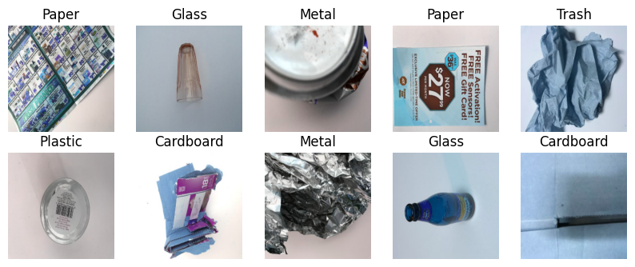
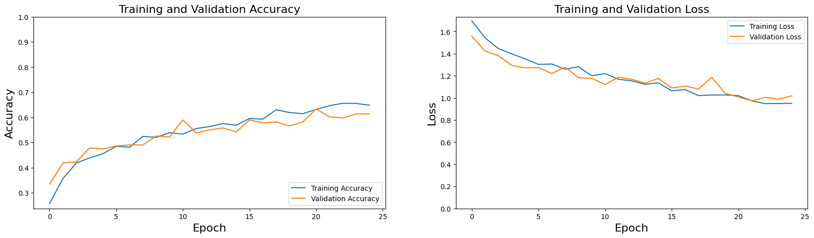
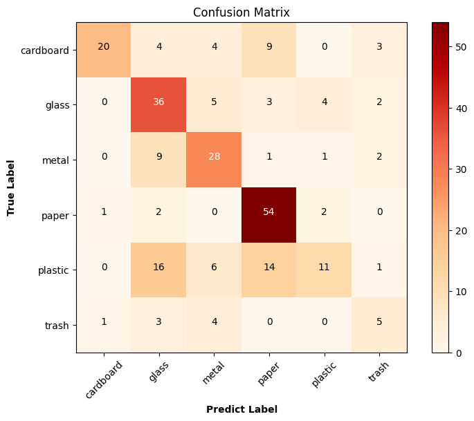
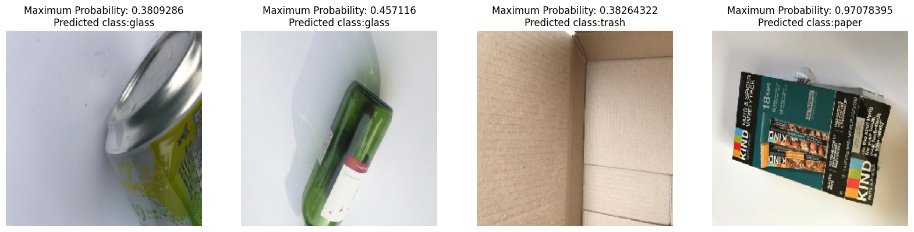

# Garbage Classification with Convolutional Neural Network (CNN)

## Connecting Google Colab to Google Drive


```python
from google.colab import drive
drive.mount('/content/drive')
```

    Mounted at /content/drive


# Solid Waste Detection with Convolutional Neural Networks (CNN)

1) Business Problem

2) Data Understanding

3) Data Preparation

4) Modelling

5) Evaluation

# 1) Business Problem

# 2) Data Understanding

## Dataset Story

The data set we will use in this project is TrashNet. It was prepared by Stanaford University students. The dataset consists of six different classes. There are a total of 2527 images in the dataset, including Glass, Paper, Cardboard, Plastic, Metal and Garbage.

Distribution of images:

- 501 glasses
- 594 paper
- 403 cardboard
- 482 plastic
- 410 metal
- 137 trash


The images were taken by placing them on a white board and using sunlight or room lighting. The images have a size of 512x384 pixels and 3 (RGB) channels.

## 2.1) Import Operations of Required Libraries


```python
# Import the necessary libraries
import cv2
import urllib
import itertools
import numpy as np
import pandas as pd
import seaborn as sns
import random, os, glob
from imutils import paths
import matplotlib.pyplot as plt
from sklearn.utils import shuffle
from urllib.request import urlopen
from sklearn.metrics import classification_report
from sklearn.metrics import confusion_matrix

# It is used to switch off warnings.
import warnings
warnings.filterwarnings('ignore')

# Libraries to be used for the model
import tensorflow as tf
from tensorflow.keras.models import Sequential
from tensorflow.keras.preprocessing import image
from tensorflow.keras.utils import to_categorical
from tensorflow.keras.callbacks import ModelCheckpoint, EarlyStopping
from tensorflow.keras.layers import Conv2D, Flatten, MaxPooling2D, Dense, Dropout, SpatialDropout2D
from tensorflow.keras.preprocessing.image import ImageDataGenerator, img_to_array, load_img, array_to_img
```


```python
!pip install imutils
```

    Requirement already satisfied: imutils in /usr/local/lib/python3.10/dist-packages (0.5.4)


## 2.2) Reading the Data Set


1. Pairing the Google Colab Notebook with the Google Drive account.
2. Upload the data set to Google Drive and show the address to the notebook
3. Defining the function to read the data set.


```python
# Keeping the path information of the images in this data set in the drive
dir_path = '/content/drive/MyDrive/Garbage_classification'
```


```python
# Determining Target size and Label Label Values

target_size = (224, 224)

waste_labels = {'cardboard': 0, 'glass': 1, 'metal': 2, 'paper': 3, 'plastic': 4, 'trash': 5}
```


```python
def load_datasets(path):

# Reads the image from the directory of images and creates the tags.

# Parameters

# path: The directory where the images are located.

# return:

# x: List holding the class information to which the images belong.

  x = []
  labels = []

  # It lists and sorts the images in the path we send.
  image_paths = sorted(list(paths.list_images(path)))

  for image_path in image_paths:
    # The images in the specified path are read with the openCV library.
    img = cv2.imread(image_path)

    # The read images are rescaled according to the initially specified target_size.
    img = cv2.resize(img, target_size)

    # Scaled images are added to the x list.
    x.append(img)

    # When each path is separated by '/', the second to last element of the returned list represents the label.
    label = image_path.split(os.path.sep)[-2]

    # A label is created by taking the value value corresponding to the key value sent from the waste_labels dictionary, which contains the numeric value equivalents of the captured labels.
    labels.append(waste_labels[label])

    # The data set is randomly shuffled.
    x, labels = shuffle(x, labels, random_state = 42)

  # Size and class information is reported.
  print(f"X size: {np.array(x).shape}")
  print(f"Label class number: {len(np.unique(labels))} Number of observations: {len(labels)}")

  return x, labels
```


```python
x, labels = load_datasets(dir_path)
```

    X size: (2527, 224, 224, 3)
    Label class number: 6 Number of observations: 2527


```python
# Retention of image sizes
input_shape = (np.array(x[0]).shape[1],np.array(x[0]).shape[1], 3)
print(input_shape)
```

    (224, 224, 3)


## 2.3) Showing Examples from the Data Set


```python
def visualize_img(image_batch, label_batch):

# The image is visualised from the data set.

# Parameters

# image_batch: Holds the martrix information of the images.

# label_batch: List holding the class information of the image.

  plt.figure(figsize=(10, 10))
  for n in range(10):
    ax = plt.subplot(5,5,n+1)
    plt.imshow(image_batch[n])
    plt.title(np.array(list(waste_labels.keys()))[to_categorical(labels, num_classes=6)[n]==1][0].title())
    plt.axis('off')
```


```python
visualize_img(x, labels)
```


    

    


# 3 Data Preparation


```python
# We define a generator for the Train dataset.
train = ImageDataGenerator(horizontal_flip=True,
                           vertical_flip=True,
                           validation_split=0.1,
                           rescale=1./255,
                           shear_range = 0.1,
                           zoom_range = 0.1,
                           width_shift_range= 0.1,
                           height_shift_range = 0.1)

# We define a generator for the test data set.
test = ImageDataGenerator(rescale=1/255,
                          validation_split=0.1)
```


```python
train_generator=train.flow_from_directory(directory=dir_path,
                                          target_size=(target_size),
                                          class_mode='categorical',
                                          subset='training')

test_generator=test.flow_from_directory(directory=dir_path,
                                        target_size=(target_size),
                                        batch_size=251,
                                        class_mode='categorical',
                                        subset='validation')
```

    Found 2276 images belonging to 6 classes.
    Found 251 images belonging to 6 classes.


# 4) Modeling

## 4.1) Building a CNN Model from Scratch

- Sequential
- Convolution Layer (Convolotion Layer, Conv2D)
- Pooling Layer
- Activation Function Layer (Activation Layer)
- Flattening Layer
- Dense Layer
- Dropout Layer


```python
model=Sequential()
model.add(Conv2D(filters=32, kernel_size=(3,3), padding='same', input_shape=(input_shape), activation='relu'))
model.add(MaxPooling2D(pool_size=2, strides=(2,2)))

model.add(Conv2D(filters=64, kernel_size=(3,3), padding='same', input_shape=(input_shape), activation='relu'))
model.add(MaxPooling2D(pool_size=2, strides=(2,2)))

model.add(Conv2D(filters=32, kernel_size=(3,3), padding='same', input_shape=(input_shape), activation='relu'))
model.add(MaxPooling2D(pool_size=2, strides=(2,2)))

model.add(Flatten())

model.add(Dense(units=64, activation='relu'))
model.add(Dropout(rate=0.2))

model.add(Dense(units=32, activation='relu'))
model.add(Dropout(rate=0.2))

model.add(Dense(units=6, activation='softmax'))
```

## 4.2) Model Summary


```python
model.summary()
```

    Model: "sequential"
    _________________________________________________________________
     Layer (type)                Output Shape              Param #   
    =================================================================
     conv2d (Conv2D)             (None, 224, 224, 32)      896       
                                                                     
     max_pooling2d (MaxPooling2  (None, 112, 112, 32)      0         
     D)                                                              
                                                                     
     conv2d_1 (Conv2D)           (None, 112, 112, 64)      18496     
                                                                     
     max_pooling2d_1 (MaxPoolin  (None, 56, 56, 64)        0         
     g2D)                                                            
                                                                     
     conv2d_2 (Conv2D)           (None, 56, 56, 32)        18464     
                                                                     
     max_pooling2d_2 (MaxPoolin  (None, 28, 28, 32)        0         
     g2D)                                                            
                                                                     
     flatten (Flatten)           (None, 25088)             0         
                                                                     
     dense (Dense)               (None, 64)                1605696   
                                                                     
     dropout (Dropout)           (None, 64)                0         
                                                                     
     dense_1 (Dense)             (None, 32)                2080      
                                                                     
     dropout_1 (Dropout)         (None, 32)                0         
                                                                     
     dense_2 (Dense)             (None, 6)                 198       
                                                                     
    =================================================================
    Total params: 1645830 (6.28 MB)
    Trainable params: 1645830 (6.28 MB)
    Non-trainable params: 0 (0.00 Byte)
    _________________________________________________________________


## 4.3) Setting Optimisation and Evaluation Metrics


```python
model.compile(loss='categorical_crossentropy',
              optimizer='adam',
              metrics=[tf.keras.metrics.Precision(), tf.keras.metrics.Recall(), "acc"])
```


```python
callbacks = [EarlyStopping(monitor='val_loss', patience=50, verbose=1, mode="min"),

             ModelCheckpoint(filepath='mymodel.h5', monitor='val_loss', mode='min', save_best_only=True, save_weights_only=False, verbose=1)]
```

## 4.4) Training the Model


```python
history = model.fit_generator(generator=train_generator,
                              epochs=25,
                              validation_data=test_generator,
                              callbacks=callbacks,
                              workers=4,
                              steps_per_epoch=2276//32,
                              validation_steps=251//32)
```

    Epoch 1/25
    71/71 [==============================] - ETA: 0s - loss: 1.6963 - precision: 0.5238 - recall: 0.0245 - acc: 0.2571
    Epoch 1: val_loss improved from inf to 1.55716, saving model to mymodel.h5
    71/71 [==============================] - 74s 804ms/step - loss: 1.6963 - precision: 0.5238 - recall: 0.0245 - acc: 0.2571 - val_loss: 1.5572 - val_precision: 0.5556 - val_recall: 0.0996 - val_acc: 0.3347
    Epoch 2/25
    71/71 [==============================] - ETA: 0s - loss: 1.5425 - precision: 0.6532 - recall: 0.0865 - acc: 0.3561
    Epoch 2: val_loss improved from 1.55716 to 1.42398, saving model to mymodel.h5
    71/71 [==============================] - 46s 634ms/step - loss: 1.5425 - precision: 0.6532 - recall: 0.0865 - acc: 0.3561 - val_loss: 1.4240 - val_precision: 0.8485 - val_recall: 0.1116 - val_acc: 0.4183
    Epoch 3/25
    71/71 [==============================] - ETA: 0s - loss: 1.4453 - precision: 0.6824 - recall: 0.1551 - acc: 0.4180
    Epoch 3: val_loss improved from 1.42398 to 1.38125, saving model to mymodel.h5
    71/71 [==============================] - 47s 635ms/step - loss: 1.4453 - precision: 0.6824 - recall: 0.1551 - acc: 0.4180 - val_loss: 1.3812 - val_precision: 0.7843 - val_recall: 0.1594 - val_acc: 0.4223
    Epoch 4/25
    71/71 [==============================] - ETA: 0s - loss: 1.3984 - precision: 0.7188 - recall: 0.1845 - acc: 0.4385
    Epoch 4: val_loss improved from 1.38125 to 1.29380, saving model to mymodel.h5
    71/71 [==============================] - 49s 666ms/step - loss: 1.3984 - precision: 0.7188 - recall: 0.1845 - acc: 0.4385 - val_loss: 1.2938 - val_precision: 0.8235 - val_recall: 0.2231 - val_acc: 0.4781
    Epoch 5/25
    71/71 [==============================] - ETA: 0s - loss: 1.3533 - precision: 0.7249 - recall: 0.2219 - acc: 0.4550
    Epoch 5: val_loss improved from 1.29380 to 1.27181, saving model to mymodel.h5
    71/71 [==============================] - 54s 752ms/step - loss: 1.3533 - precision: 0.7249 - recall: 0.2219 - acc: 0.4550 - val_loss: 1.2718 - val_precision: 0.8594 - val_recall: 0.2191 - val_acc: 0.4741
    Epoch 6/25
    71/71 [==============================] - ETA: 0s - loss: 1.3035 - precision: 0.7107 - recall: 0.2496 - acc: 0.4848
    Epoch 6: val_loss did not improve from 1.27181
    71/71 [==============================] - 55s 765ms/step - loss: 1.3035 - precision: 0.7107 - recall: 0.2496 - acc: 0.4848 - val_loss: 1.2750 - val_precision: 0.8730 - val_recall: 0.2191 - val_acc: 0.4861
    Epoch 7/25
    71/71 [==============================] - ETA: 0s - loss: 1.3064 - precision: 0.7203 - recall: 0.2433 - acc: 0.4808
    Epoch 7: val_loss improved from 1.27181 to 1.22008, saving model to mymodel.h5
    71/71 [==============================] - 50s 692ms/step - loss: 1.3064 - precision: 0.7203 - recall: 0.2433 - acc: 0.4808 - val_loss: 1.2201 - val_precision: 0.7614 - val_recall: 0.2669 - val_acc: 0.4900
    Epoch 8/25
    71/71 [==============================] - ETA: 0s - loss: 1.2596 - precision: 0.7497 - recall: 0.2790 - acc: 0.5241
    Epoch 8: val_loss did not improve from 1.22008
    71/71 [==============================] - 50s 694ms/step - loss: 1.2596 - precision: 0.7497 - recall: 0.2790 - acc: 0.5241 - val_loss: 1.2784 - val_precision: 0.7816 - val_recall: 0.2709 - val_acc: 0.4900
    Epoch 9/25
    71/71 [==============================] - ETA: 0s - loss: 1.2822 - precision: 0.7188 - recall: 0.2745 - acc: 0.5201
    Epoch 9: val_loss improved from 1.22008 to 1.18306, saving model to mymodel.h5
    71/71 [==============================] - 49s 680ms/step - loss: 1.2822 - precision: 0.7188 - recall: 0.2745 - acc: 0.5201 - val_loss: 1.1831 - val_precision: 0.7264 - val_recall: 0.3068 - val_acc: 0.5259
    Epoch 10/25
    71/71 [==============================] - ETA: 0s - loss: 1.2001 - precision: 0.7325 - recall: 0.3222 - acc: 0.5388
    Epoch 10: val_loss improved from 1.18306 to 1.17670, saving model to mymodel.h5
    71/71 [==============================] - 46s 637ms/step - loss: 1.2001 - precision: 0.7325 - recall: 0.3222 - acc: 0.5388 - val_loss: 1.1767 - val_precision: 0.8191 - val_recall: 0.3068 - val_acc: 0.5219
    Epoch 11/25
    70/71 [============================>.] - ETA: 0s - loss: 1.2200 - precision: 0.7322 - recall: 0.3076 - acc: 0.5335
    Epoch 11: val_loss improved from 1.17670 to 1.12107, saving model to mymodel.h5
    71/71 [==============================] - 56s 775ms/step - loss: 1.2201 - precision: 0.7325 - recall: 0.3075 - acc: 0.5334 - val_loss: 1.1211 - val_precision: 0.7788 - val_recall: 0.3227 - val_acc: 0.5896
    Epoch 12/25
    71/71 [==============================] - ETA: 0s - loss: 1.1690 - precision: 0.7284 - recall: 0.3538 - acc: 0.5553
    Epoch 12: val_loss did not improve from 1.12107
    71/71 [==============================] - 56s 781ms/step - loss: 1.1690 - precision: 0.7284 - recall: 0.3538 - acc: 0.5553 - val_loss: 1.1871 - val_precision: 0.6721 - val_recall: 0.3267 - val_acc: 0.5378
    Epoch 13/25
    71/71 [==============================] - ETA: 0s - loss: 1.1546 - precision: 0.7558 - recall: 0.3627 - acc: 0.5633
    Epoch 13: val_loss did not improve from 1.12107
    71/71 [==============================] - 48s 656ms/step - loss: 1.1546 - precision: 0.7558 - recall: 0.3627 - acc: 0.5633 - val_loss: 1.1687 - val_precision: 0.7177 - val_recall: 0.3546 - val_acc: 0.5498
    Epoch 14/25
    71/71 [==============================] - ETA: 0s - loss: 1.1233 - precision: 0.7398 - recall: 0.3864 - acc: 0.5749
    Epoch 14: val_loss did not improve from 1.12107
    71/71 [==============================] - 45s 626ms/step - loss: 1.1233 - precision: 0.7398 - recall: 0.3864 - acc: 0.5749 - val_loss: 1.1339 - val_precision: 0.7190 - val_recall: 0.3466 - val_acc: 0.5578
    Epoch 15/25
    71/71 [==============================] - ETA: 0s - loss: 1.1361 - precision: 0.7513 - recall: 0.3743 - acc: 0.5686
    Epoch 15: val_loss did not improve from 1.12107
    71/71 [==============================] - 55s 760ms/step - loss: 1.1361 - precision: 0.7513 - recall: 0.3743 - acc: 0.5686 - val_loss: 1.1759 - val_precision: 0.7788 - val_recall: 0.3227 - val_acc: 0.5418
    Epoch 16/25
    71/71 [==============================] - ETA: 0s - loss: 1.0642 - precision: 0.7717 - recall: 0.4202 - acc: 0.5954
    Epoch 16: val_loss improved from 1.12107 to 1.09011, saving model to mymodel.h5
    71/71 [==============================] - 49s 680ms/step - loss: 1.0642 - precision: 0.7717 - recall: 0.4202 - acc: 0.5954 - val_loss: 1.0901 - val_precision: 0.7361 - val_recall: 0.4223 - val_acc: 0.5896
    Epoch 17/25
    71/71 [==============================] - ETA: 0s - loss: 1.0752 - precision: 0.7662 - recall: 0.4278 - acc: 0.5927
    Epoch 17: val_loss did not improve from 1.09011
    71/71 [==============================] - 48s 671ms/step - loss: 1.0752 - precision: 0.7662 - recall: 0.4278 - acc: 0.5927 - val_loss: 1.1076 - val_precision: 0.7797 - val_recall: 0.3665 - val_acc: 0.5777
    Epoch 18/25
    71/71 [==============================] - ETA: 0s - loss: 1.0214 - precision: 0.7831 - recall: 0.4505 - acc: 0.6301
    Epoch 18: val_loss improved from 1.09011 to 1.07964, saving model to mymodel.h5
    71/71 [==============================] - 46s 636ms/step - loss: 1.0214 - precision: 0.7831 - recall: 0.4505 - acc: 0.6301 - val_loss: 1.0796 - val_precision: 0.7769 - val_recall: 0.3745 - val_acc: 0.5817
    Epoch 19/25
    71/71 [==============================] - ETA: 0s - loss: 1.0263 - precision: 0.7595 - recall: 0.4461 - acc: 0.6190
    Epoch 19: val_loss did not improve from 1.07964
    71/71 [==============================] - 55s 758ms/step - loss: 1.0263 - precision: 0.7595 - recall: 0.4461 - acc: 0.6190 - val_loss: 1.1865 - val_precision: 0.6993 - val_recall: 0.3984 - val_acc: 0.5657
    Epoch 20/25
    71/71 [==============================] - ETA: 0s - loss: 1.0267 - precision: 0.7709 - recall: 0.4439 - acc: 0.6145
    Epoch 20: val_loss improved from 1.07964 to 1.04175, saving model to mymodel.h5
    71/71 [==============================] - 54s 753ms/step - loss: 1.0267 - precision: 0.7709 - recall: 0.4439 - acc: 0.6145 - val_loss: 1.0418 - val_precision: 0.7273 - val_recall: 0.4143 - val_acc: 0.5817
    Epoch 21/25
    71/71 [==============================] - ETA: 0s - loss: 1.0206 - precision: 0.7715 - recall: 0.4514 - acc: 0.6315
    Epoch 21: val_loss improved from 1.04175 to 1.00888, saving model to mymodel.h5
    71/71 [==============================] - 49s 661ms/step - loss: 1.0206 - precision: 0.7715 - recall: 0.4514 - acc: 0.6315 - val_loss: 1.0089 - val_precision: 0.8462 - val_recall: 0.4382 - val_acc: 0.6335
    Epoch 22/25
    71/71 [==============================] - ETA: 0s - loss: 0.9737 - precision: 0.7846 - recall: 0.4804 - acc: 0.6462
    Epoch 22: val_loss improved from 1.00888 to 0.97284, saving model to mymodel.h5
    71/71 [==============================] - 55s 758ms/step - loss: 0.9737 - precision: 0.7846 - recall: 0.4804 - acc: 0.6462 - val_loss: 0.9728 - val_precision: 0.8028 - val_recall: 0.4542 - val_acc: 0.6016
    Epoch 23/25
    71/71 [==============================] - ETA: 0s - loss: 0.9484 - precision: 0.7948 - recall: 0.5076 - acc: 0.6560
    Epoch 23: val_loss did not improve from 0.97284
    71/71 [==============================] - 49s 682ms/step - loss: 0.9484 - precision: 0.7948 - recall: 0.5076 - acc: 0.6560 - val_loss: 1.0046 - val_precision: 0.7407 - val_recall: 0.4781 - val_acc: 0.5976
    Epoch 24/25
    71/71 [==============================] - ETA: 0s - loss: 0.9492 - precision: 0.7879 - recall: 0.5000 - acc: 0.6551
    Epoch 24: val_loss did not improve from 0.97284
    71/71 [==============================] - 45s 626ms/step - loss: 0.9492 - precision: 0.7879 - recall: 0.5000 - acc: 0.6551 - val_loss: 0.9884 - val_precision: 0.8042 - val_recall: 0.4582 - val_acc: 0.6135
    Epoch 25/25
    71/71 [==============================] - ETA: 0s - loss: 0.9505 - precision: 0.7792 - recall: 0.4987 - acc: 0.6484
    Epoch 25: val_loss did not improve from 0.97284
    71/71 [==============================] - 53s 722ms/step - loss: 0.9505 - precision: 0.7792 - recall: 0.4987 - acc: 0.6484 - val_loss: 1.0186 - val_precision: 0.7692 - val_recall: 0.4781 - val_acc: 0.6135


## 4.5) Accuracy and Loss Graphs


```python
# Accuracy Graph
plt.figure(figsize=(20, 5))
plt.subplot(1, 2, 1)
plt.plot(history.history['acc'], label ='Training Accuracy')
plt.plot(history.history['val_acc'], label ='Validation Accuracy')
plt.legend(loc='lower right')
plt.xlabel('Epoch', fontsize=16)
plt.ylabel('Accuracy', fontsize=16)
plt.ylim([min(plt.ylim()),1])
plt.title('Training and Validation Accuracy', fontsize=16)


# Loss Graph
plt.subplot(1, 2, 2)
plt.plot(history.history['loss'], label ='Training Loss')
plt.plot(history.history['val_loss'], label ='Validation Loss')
plt.legend(loc='upper right')
plt.xlabel('Epoch', fontsize=16)
plt.ylabel('Loss', fontsize=16)
plt.ylim([0, max(plt.ylim())])
plt.title('Training and Validation Loss', fontsize=16)
plt.show()
```


    

    


# 5) Evaluation


```python
loss, precision, recall, acc = model.evaluate(test_generator, batch_size=32)
print("\nTest Accuracy: %.1f%%" % (100.0 * acc))
print("\nTest Loss: %.1f%%" % (100.0 * loss))
print("\nTest Precision: %.1f%%" % (100.0 * precision))
print("\nTest Recall: %.1f%%" % (100.0 * recall))
```

    1/1 [==============================] - 1s 1s/step - loss: 1.0186 - precision: 0.7692 - recall: 0.4781 - acc: 0.6135
    
    Test Accuracy: 61.4%
    
    Test Loss: 101.9%
    
    Test Precision: 76.9%
    
    Test Recall: 47.8%


```python
# Classification Report
x_test, y_test = test_generator.next()
y_pred = model.predict(x_test)
y_pred = np.argmax(y_pred, axis=1)
y_test = np.argmax(y_test, axis=1)
y_pred
```

    8/8 [==============================] - 1s 52ms/step


    array([1, 3, 1, 2, 3, 3, 1, 0, 3, 1, 5, 0, 1, 3, 2, 2, 1, 3, 2, 2, 1, 0,
           3, 1, 4, 1, 3, 0, 3, 2, 1, 2, 3, 1, 2, 3, 1, 1, 3, 2, 5, 2, 3, 1,
           1, 3, 2, 1, 1, 1, 3, 5, 4, 3, 2, 3, 2, 2, 1, 4, 3, 3, 0, 3, 3, 4,
           1, 1, 1, 5, 0, 1, 3, 4, 1, 2, 3, 1, 3, 3, 3, 1, 5, 2, 2, 1, 5, 3,
           1, 3, 1, 1, 0, 2, 3, 3, 4, 2, 3, 3, 2, 4, 1, 0, 3, 1, 2, 0, 1, 2,
           4, 3, 3, 2, 2, 4, 5, 0, 2, 3, 3, 2, 0, 1, 2, 3, 2, 3, 3, 2, 1, 2,
           2, 1, 3, 1, 3, 1, 0, 3, 1, 4, 1, 3, 3, 1, 2, 5, 3, 3, 2, 0, 2, 1,
           3, 3, 4, 1, 2, 3, 5, 2, 0, 1, 1, 1, 3, 1, 1, 4, 3, 3, 3, 1, 0, 1,
           2, 4, 3, 5, 0, 3, 3, 0, 5, 3, 2, 1, 2, 3, 3, 5, 3, 3, 3, 0, 0, 1,
           3, 1, 1, 1, 1, 3, 1, 1, 2, 1, 3, 0, 1, 1, 2, 2, 1, 3, 3, 3, 1, 0,
           1, 2, 3, 3, 1, 3, 3, 2, 4, 4, 0, 2, 3, 3, 1, 2, 3, 3, 2, 3, 5, 1,
           1, 3, 4, 4, 3, 4, 1, 3, 1])


```python
target_names = list(waste_labels.keys())
```


```python
print(classification_report(y_test, y_pred, target_names=target_names))
```

                  precision    recall  f1-score   support
    
       cardboard       0.91      0.50      0.65        40
           glass       0.51      0.72      0.60        50
           metal       0.60      0.68      0.64        41
           paper       0.67      0.92      0.77        59
         plastic       0.61      0.23      0.33        48
           trash       0.38      0.38      0.38        13
    
        accuracy                           0.61       251
       macro avg       0.61      0.57      0.56       251
    weighted avg       0.64      0.61      0.59       251
    


```python
# Confusion Matrix
cm = confusion_matrix(y_test, y_pred)

def plot_confusion_matrix(cm, classes,
                          normalize=False,
                          title='Confusion Matrix',
                          cmap=plt.cm.Blues):

# This function prints and plots the confusion matrix.
# Normalization can be applied by setting `normalize=True`.

  if normalize:
    cm = cm.astype('float') / cm.sum(axis=1)[:, np.newaxis]

  plt.figure(figsize=(8,6))
  plt.imshow(cm, interpolation='nearest', cmap=cmap)
  plt.title(title)
  plt.colorbar()
  tick_marks = np.arange(len(classes))
  plt.xticks(tick_marks, classes, rotation=45)
  plt.yticks(tick_marks, classes)
  fmt = '.2f' if normalize else 'd'
  thresh = cm.max() / 2.
  for i, j in itertools.product(range(cm.shape[0]), range(cm.shape[1])):
    plt.text(j, i, format(cm[i, j], fmt),
             horizontalalignment="center",
             color="white" if cm[i, j] > thresh else "black")
  plt.tight_layout()
  plt.ylabel('True Label', fontweight="bold")
  plt.xlabel('Predict Label', fontweight="bold")
```


```python
plot_confusion_matrix(cm, waste_labels.keys(),
                      title='Confusion Matrix',
                      cmap=plt.cm.OrRd)
```


    

    


# Using / Testing the Model


```python
waste_labels = {0: 'cardboard', 1: 'glass', 2: 'metal', 3: 'paper', 4: 'plastic', 5: 'trash'}
```


```python
def model_testing(path):

# By reading the image in the directory where the images are located, the model is used to predict which class it belongs to.

# Parameters

# path: The directory where the images are located.

# Return:

# img: Image

# p: Prediction probabilities

# predicted_class: Predicted class

  img = image.load_img(path, target_size=(target_size))
  img = image.img_to_array(img, dtype=np.uint8)
  img=np.array(img)/255.0
  p=model.predict(img.reshape(1, 224, 224, 3))
  predicted_class = np.argmax(p[0])

  return img, p, predicted_class
```


```python
img1, p1, predicted_class1 = model_testing('/content/drive/MyDrive/Garbage_classification/metal/metal10.jpg')
img2, p2, predicted_class2 = model_testing('/content/drive/MyDrive/Garbage_classification/glass/glass105.jpg')
img3, p3, predicted_class3 = model_testing('/content/drive/MyDrive/Garbage_classification/cardboard/cardboard103.jpg')
img4, p4, predicted_class4 = model_testing('/content/drive/MyDrive/Garbage_classification/paper/paper106.jpg')

plt.figure(figsize=(20,60))

plt.subplot(141)
plt.axis('off')
plt.imshow(img1.squeeze())
plt.title("Maximum Probability: " + str(np.max(p1[0], axis = 0)) + "\n" + "Predicted class:" + str(waste_labels[predicted_class1]))
plt.imshow(img1);

plt.subplot(142)
plt.axis('off')
plt.imshow(img2.squeeze())
plt.title("Maximum Probability: " + str(np.max(p2[0], axis = 0)) + "\n" + "Predicted class:" + str(waste_labels[predicted_class2]))
plt.imshow(img2);

plt.subplot(143)
plt.axis('off')
plt.imshow(img3.squeeze())
plt.title("Maximum Probability: " + str(np.max(p3[0], axis = 0)) + "\n" + "Predicted class:" + str(waste_labels[predicted_class3]))
plt.imshow(img3);

plt.subplot(144)
plt.axis('off')
plt.imshow(img4.squeeze())
plt.title("Maximum Probability: " + str(np.max(p4[0], axis = 0)) + "\n" + "Predicted class:" + str(waste_labels[predicted_class4]))
plt.imshow(img4);
```

    1/1 [==============================] - 0s 80ms/step
    1/1 [==============================] - 0s 18ms/step
    1/1 [==============================] - 0s 18ms/step
    1/1 [==============================] - 0s 25ms/step


    

    

